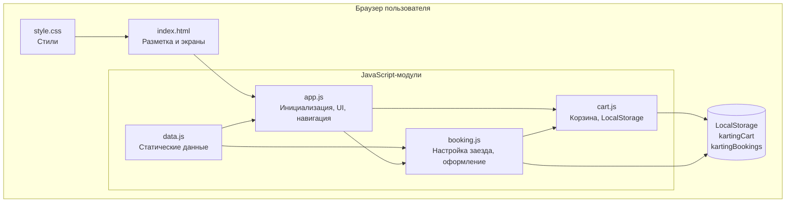
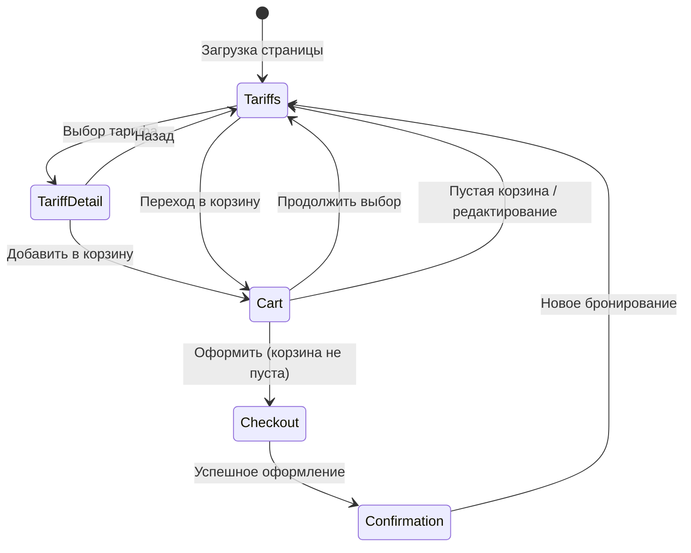
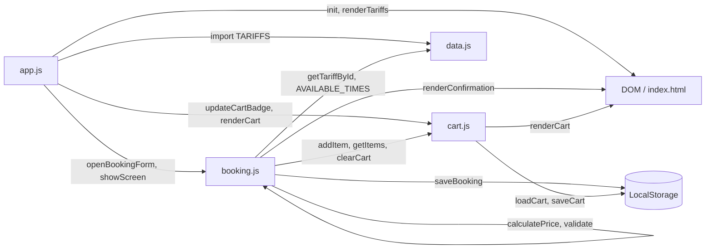
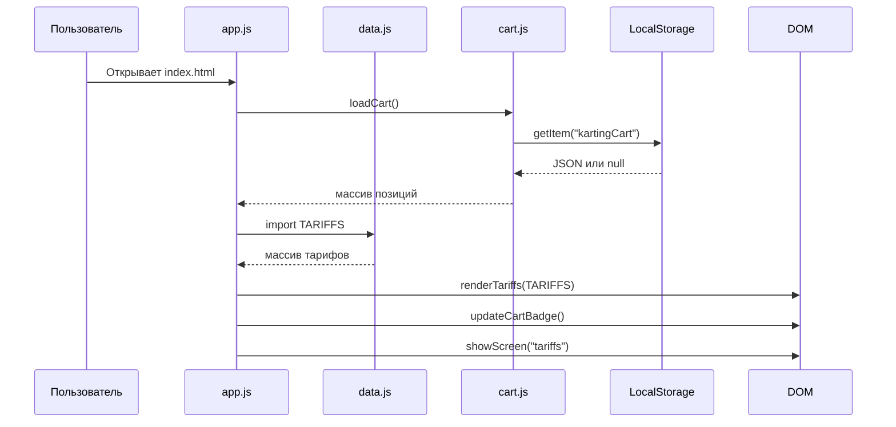
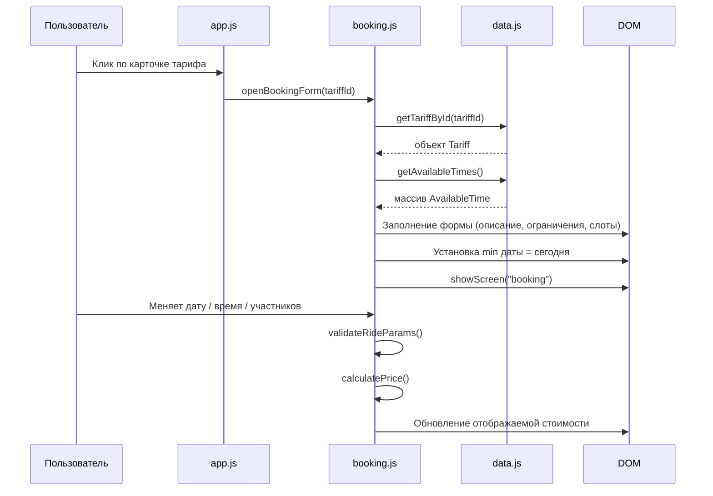
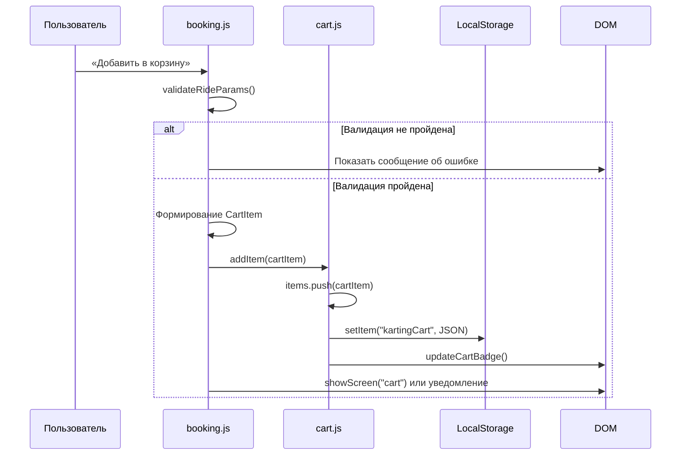
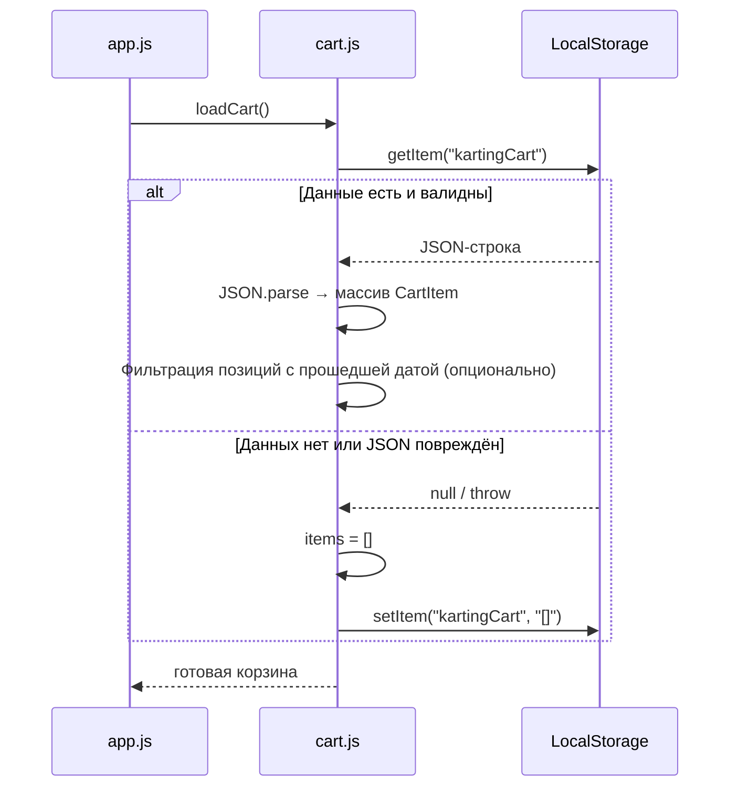
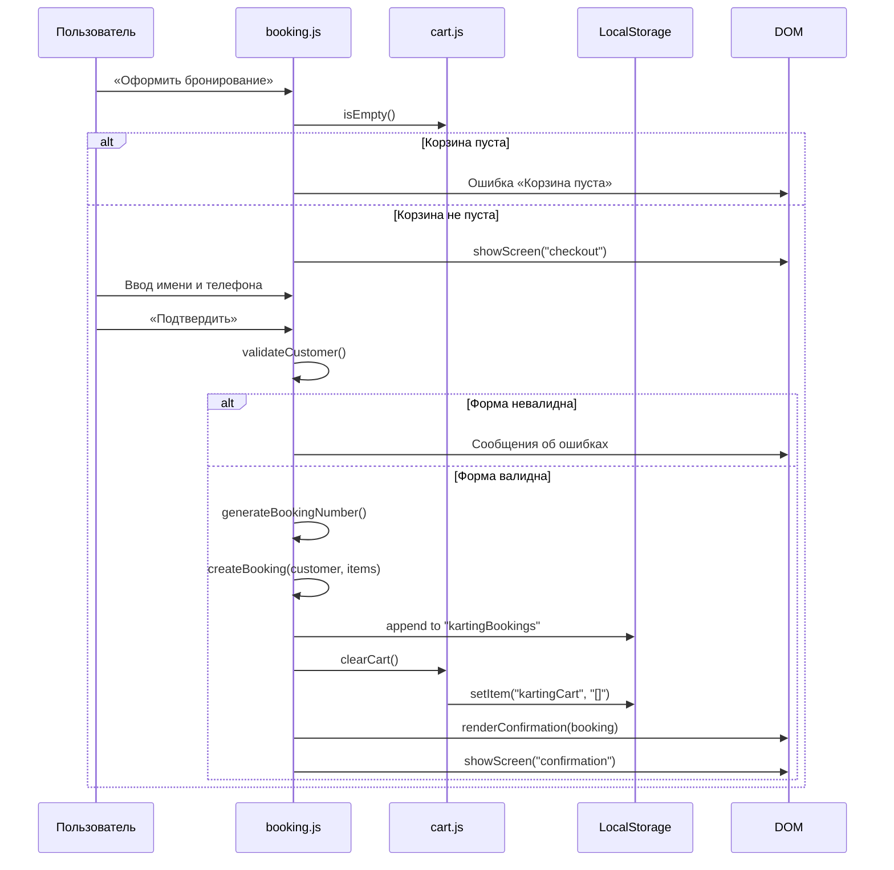
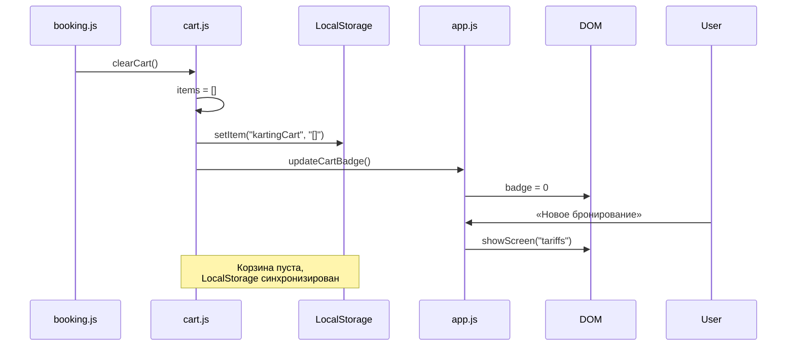

# Karting Drive — архитектурный план

## 1. Назначение документа

Документ описывает архитектуру клиентского веб-приложения **Karting Drive** на этапе проектирования (до реализации кода). Он определяет структуру файлов, распределение ответственности между модулями, потоки данных, работу с LocalStorage и ключевые архитектурные решения.

Документ опирается на требования из [`01-mvp-requirements.md`](01-mvp-requirements.md) и схему данных из [`03-data-model.md`](03-data-model.md).

---

## 2. Архитектурный подход

Приложение строится по принципу **клиентского SPA без серверной части**:

- Единственная HTML-страница (`index.html`) содержит все экраны интерфейса.
- Логика разделена на ES-модули в каталоге `js/`.
- Статические данные (тарифы, слоты времени) хранятся в `data.js`.
- Состояние корзины персистится в **LocalStorage** браузера.
- Навигация между экранами выполняется на JavaScript без перезагрузки страницы.
- Фреймворки и внешние библиотеки не используются.



---

## 3. Общая схема приложения

Приложение реализует линейный пользовательский путь с возможностью возврата к каталогу тарифов:



**Экраны интерфейса** (секции в `index.html`, переключаемые через CSS-классы или атрибуты):

| Экран | ID (план) | Назначение |
|-------|-----------|------------|
| Каталог тарифов | `#screen-tariffs` | Список карточек тарифов |
| Настройка заезда | `#screen-booking` | Детали тарифа, дата, время, участники, стоимость |
| Корзина | `#screen-cart` | Позиции, редактирование, итоговая сумма |
| Оформление | `#screen-checkout` | Форма имени и телефона |
| Подтверждение | `#screen-confirmation` | Номер бронирования и сводка |

---

## 4. Слои приложения

| Слой | Реализация | Ответственность |
|------|------------|-----------------|
| **Presentation** | `index.html`, `style.css`, функции рендеринга в `app.js` | Разметка, стили, отображение данных, переключение экранов |
| **Application** | `app.js`, `booking.js` | Оркестрация сценариев: выбор тарифа, валидация, оформление |
| **Domain** | `cart.js`, функции расчёта в `booking.js` | Бизнес-логика: корзина, расчёт цены, генерация номера бронирования |
| **Data** | `data.js`, LocalStorage API | Статический каталог тарифов, персистентное хранение корзины и бронирований |

Слои не изолированы физически (нет DI-контейнера) — связь через прямые импорты ES-модулей и общие функции.

---

## 5. Назначение HTML, CSS и JavaScript

### HTML (`index.html`)

- Семантическая структура: `header`, `main`, `footer`.
- Контейнеры для каждого экрана приложения.
- Шаблонные области для динамического контента (карточки тарифов, позиции корзины).
- Формы: выбор даты/времени/участников, контактные данные.
- Подключение модулей через `<script type="module" src="js/app.js">`.
- Без inline-логики — обработчики назначаются из JavaScript.

### CSS (`style.css`)

- Единый файл стилей для всего приложения.
- CSS-переменные для цветов, отступов, шрифтов.
- Адаптивная вёрстка (mobile-first, breakpoints для tablet/desktop).
- Стили состояний: активный экран, disabled-кнопки, сообщения об ошибках.
- Стили компонентов: карточки тарифов, корзина, формы, экран подтверждения.

### JavaScript (модули в `js/`)

- ES-модули (`import` / `export`).
- Разделение по зонам ответственности (см. раздел 6).
- DOM-манипуляции, валидация, расчёты, работа с LocalStorage.
- Без глобальных переменных в `window` (кроме точки входа).

---

## 6. Назначение каждого будущего файла

```
karting/
├── index.html          # Структура интерфейса, все экраны SPA
├── css/
│   └── style.css       # Оформление и адаптивность
├── js/
│   ├── data.js         # Тарифы и доступное время
│   ├── app.js          # Запуск приложения и отображение тарифов
│   ├── booking.js      # Выбор параметров заезда и оформление бронирования
│   └── cart.js         # Добавление, изменение, удаление и сохранение корзины
└── docs/
    ├── 01-mvp-requirements.md
    ├── 02-architecture.md
    ├── 03-data-model.md
    └── prompts.md
```

### `js/data.js`

| Экспорт (план) | Назначение |
|----------------|------------|
| `TARIFFS` | Массив объектов тарифов (4 демо-тарифа) |
| `AVAILABLE_TIMES` | Массив доступных временных слотов |
| `getTariffById(id)` | Поиск тарифа по идентификатору |
| `getAvailableTimes()` | Возврат списка слотов времени |

Данные статичны, не изменяются пользователем.

### `js/app.js`

| Функция (план) | Назначение |
|----------------|------------|
| `init()` | Точка входа: восстановление корзины, рендер тарифов, навигация |
| `renderTariffs()` | Отрисовка карточек тарифов на главном экране |
| `showScreen(screenId)` | Переключение видимого экрана |
| `updateCartBadge()` | Обновление счётчика позиций в шапке |
| `bindNavigation()` | Обработчики навигационных элементов |

Координирует модули `booking.js` и `cart.js`, не содержит бизнес-логики корзины.

### `js/booking.js`

| Функция (план) | Назначение |
|----------------|------------|
| `openBookingForm(tariffId)` | Открытие формы настройки заезда для выбранного тарифа |
| `validateRideParams(params, tariff)` | Валидация даты, времени, участников |
| `calculatePrice(tariff, participants)` | Расчёт стоимости по `priceType` |
| `handleAddToCart()` | Сбор параметров, валидация, вызов `cart.addItem()` |
| `openCheckout()` | Переход к форме оформления |
| `validateCustomer(customer)` | Валидация имени и телефона |
| `createBooking(customer, cartItems)` | Создание объекта `Booking`, генерация номера |
| `generateBookingNumber()` | Формат `KD-YYYYMMDD-XXXX` |
| `handleSubmitBooking()` | Оформление: валидация → создание → сохранение → очистка корзины |
| `renderConfirmation(booking)` | Отображение экрана подтверждения |

### `js/cart.js`

| Функция (план) | Назначение |
|----------------|------------|
| `loadCart()` | Чтение корзины из LocalStorage (`kartingCart`) |
| `saveCart()` | Запись корзины в LocalStorage |
| `getItems()` | Возврат массива позиций |
| `addItem(cartItem)` | Добавление позиции с пересчётом и сохранением |
| `updateItemParticipants(id, participants)` | Изменение участников с пересчётом `totalPrice` |
| `removeItem(id)` | Удаление позиции |
| `clearCart()` | Очистка корзины в памяти и LocalStorage |
| `getTotalPrice()` | Сумма `totalPrice` всех позиций |
| `isEmpty()` | Проверка пустой корзины |
| `renderCart()` | Отрисовка содержимого корзины |

### `css/style.css`

- Базовые стили, типографика, сетка.
- Компоненты UI: `.tariff-card`, `.cart-item`, `.time-slot`, `.btn`, `.form-field`, `.error-message`.
- Утилиты видимости: `.screen`, `.screen--active`.
- Media queries: `480px`, `768px`, `1024px`.

### `index.html`

- Шапка с логотипом, навигацией и badge корзины.
- Секции экранов (тарифы, настройка, корзина, оформление, подтверждение).
- Подвал с контактами картинг-центра.
- Пустые контейнеры для динамически генерируемого контента.

---

## 7. Взаимодействие компонентов



**Правила взаимодействия:**

- `data.js` не импортирует другие модули — только экспортирует данные и хелперы.
- `cart.js` импортирует `data.js` (для пересчёта цены при изменении участников) и `booking.js` (функция `calculatePrice`) либо содержит локальную копию расчёта — **решение:** `calculatePrice` определяется в `booking.js` и импортируется в `cart.js` для избежания дублирования.
- `booking.js` импортирует `cart.js` и `data.js`.
- `app.js` импортирует все модули, является оркестратором.
- Прямых циклических импортов избегаем: если `cart.js` нужен `calculatePrice`, он импортируется из `booking.js`; `booking.js` не импортирует функции рендеринга из `app.js`.

---

## 8. Поток данных

### 8.1. Загрузка и отображение тарифов



### 8.2. Выбор тарифа



### 8.3. Добавление заезда в корзину



### 8.4. Восстановление корзины из LocalStorage



### 8.5. Оформление бронирования



### 8.6. Очистка корзины после оформления



---

## 9. Работа с LocalStorage

### Ключи

| Ключ | Тип значения | Назначение |
|------|--------------|------------|
| `kartingCart` | `JSON` → `CartItem[]` | Персистентная корзина пользователя |
| `kartingBookings` | `JSON` → `Booking[]` | Локальный журнал оформленных бронирований (демо) |

> **Примечание:** в [`01-mvp-requirements.md`](01-mvp-requirements.md) (FR-11) указан ключ `karting-drive-cart`. На этапе проектирования принят ключ **`kartingCart`** согласно схеме данных этапа 2. При реализации используется `kartingCart`.

### Операции

| Операция | Модуль | Когда |
|----------|--------|-------|
| Чтение корзины | `cart.js` → `loadCart()` | При инициализации приложения |
| Запись корзины | `cart.js` → `saveCart()` | После add / update / remove |
| Очистка корзины | `cart.js` → `clearCart()` | После успешного оформления |
| Запись бронирования | `booking.js` | После успешного `createBooking()` |
| Чтение бронирований | `booking.js` (опционально) | Для проверки уникальности номера |

### Обработка ошибок LocalStorage

- **`JSON.parse` ошибка** → инициализация пустой корзины, перезапись ключа.
- **`localStorage` недоступен** (приватный режим, квота) → работа корзины только в памяти на время сессии; предупреждение пользователю.
- **QuotaExceededError** → сообщение пользователю, корзина остаётся в памяти.

### Формат хранения

```javascript
// kartingCart
[
  {
    "id": "ci-1709123456789",
    "tariffId": "adult",
    "tariffName": "Взрослый заезд",
    "date": "2026-07-05",
    "time": "14:00",
    "participants": 2,
    "priceType": "perPerson",
    "price": 1000,
    "totalPrice": 2000
  }
]

// kartingBookings
[
  {
    "id": "bk-1709123456790",
    "bookingNumber": "KD-20260705-A3F2",
    "customerName": "Иван Петров",
    "customerPhone": "+7 999 123-45-67",
    "items": [ /* CartItem[] */ ],
    "totalPrice": 2000,
    "createdAt": "2026-07-05T14:30:00.000Z",
    "status": "new"
  }
]
```

---

## 10. Основные архитектурные решения

| # | Решение | Обоснование |
|---|---------|-------------|
| AD-01 | Одностраничное приложение (SPA) на чистом JS | FR-19, NFR-04: без фреймворков, без перезагрузки |
| AD-02 | ES-модули вместо одного monolith-файла | NFR-05: логическое разделение кода |
| AD-03 | Статические данные в `data.js` | FR-01, BR-10: тарифы не редактируются пользователем |
| AD-04 | Корзина как единственный источник правды в памяти + синхронизация с LS | FR-11–FR-13: немедленное сохранение |
| AD-05 | `priceType` (`perPerson` / `fixed`) для гибкого расчёта | Поддержка тарифа «Аренда трассы» с фиксированной ценой |
| AD-06 | Денормализация в `CartItem` (`tariffName`, `price`, `priceType`) | Восстановление корзины без повторного обращения к каталогу |
| AD-07 | Генерация номера бронирования на клиенте | FR-16, BR-03: формат `KD-YYYYMMDD-XXXX` |
| AD-08 | Переключение экранов через CSS-классы | Простота реализации без router-библиотек |
| AD-09 | Валидация на клиенте в `booking.js` | Единая точка бизнес-правил до добавления в корзину и оформления |
| AD-10 | `kartingBookings` в LocalStorage для учебной демонстрации | Локальное хранение истории без сервера; не заменяет серверную БД |

---

## 11. Ограничения архитектуры

| Ограничение | Описание |
|-------------|----------|
| Нет серверной валидации | Все проверки выполняются на клиенте и могут быть обойдены |
| Нет реальной проверки занятости слотов | Слоты статичны (BR-05) |
| LocalStorage привязан к браузеру и устройству | Корзина не синхронизируется между устройствами |
| Нет аутентификации | Любой пользователь браузера видит и изменяет локальные данные |
| Нет онлайн-оплаты | Бронирование без финансовой транзакции (BR-04) |
| Один HTML-файл | Масштабирование UI ограничено размером DOM |
| Нет сборщика (bundler) | Модули загружаются нативно; нужен HTTP-сервер или `file://` с ограничениями CORS для модулей |

---

## 12. Возможное дальнейшее развитие

| Направление | Описание |
|-------------|----------|
| Backend API | Серверная валидация, реальная проверка слотов, персистентные бронирования |
| База данных | Хранение тарифов, заказов, клиентов |
| Авторизация | Личный кабинет, история бронирований |
| Онлайн-оплата | Интеграция платёжного шлюза |
| Admin-панель | Управление тарифами, расписанием, заказами |
| Уведомления | Email/SMS-подтверждение бронирования |
| Router | Hash- или History-API маршрутизация для deep links |
| TypeScript / сборщик | Типизация и оптимизация бандла |
| PWA | Офлайн-доступ, установка на устройство |

---

## 13. Критерии проверки архитектуры

Архитектура считается корректной, если:

- [ ] Структура файлов соответствует согласованной схеме проекта.
- [ ] Каждый модуль имеет чёткую зону ответственности без дублирования логики.
- [ ] Все user stories US-01 — US-19 покрыты потоками данных и функциями модулей.
- [ ] LocalStorage используется только для `kartingCart` и `kartingBookings`.
- [ ] Отсутствуют ссылки на сервер, API, базу данных, оплату, авторизацию.
- [ ] Потоки: загрузка тарифов, выбор тарифа, добавление в корзину, восстановление корзины, оформление, очистка — описаны и согласованы с [`03-data-model.md`](03-data-model.md).
- [ ] Архитектурные решения не противоречат FR-01 — FR-20 и BR-01 — BR-10.
- [ ] Документ может служить основой для реализации без дополнительных архитектурных решений.
