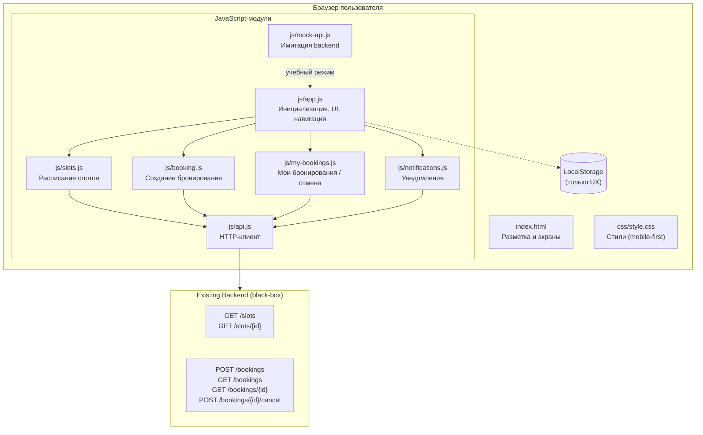
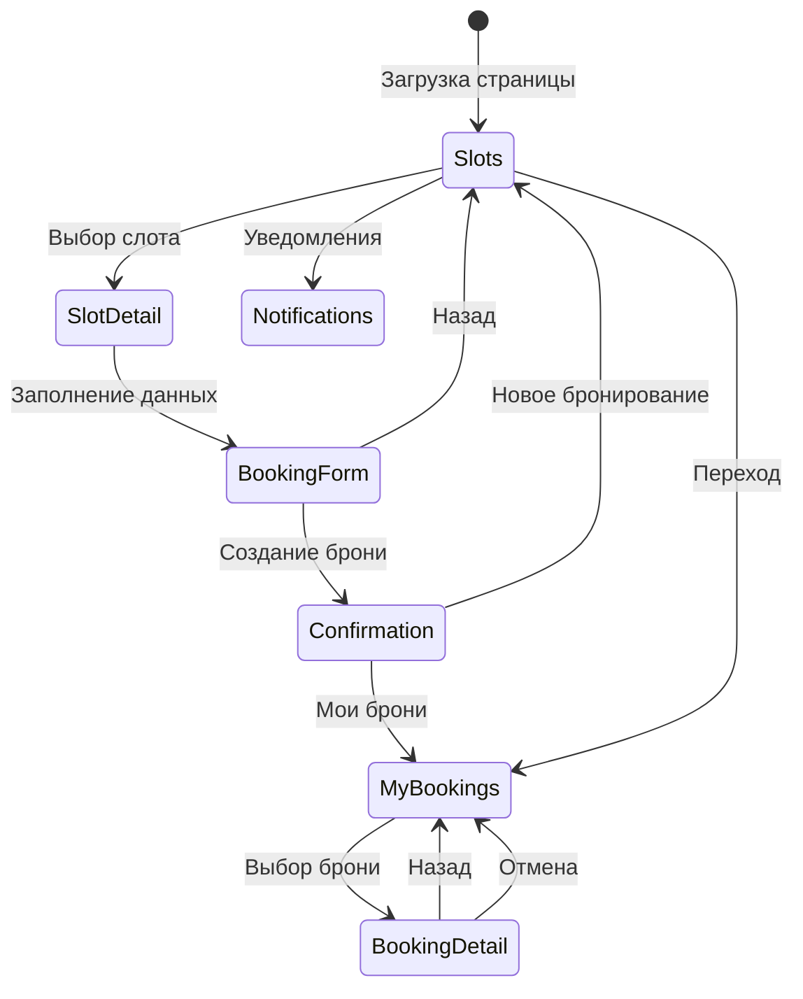
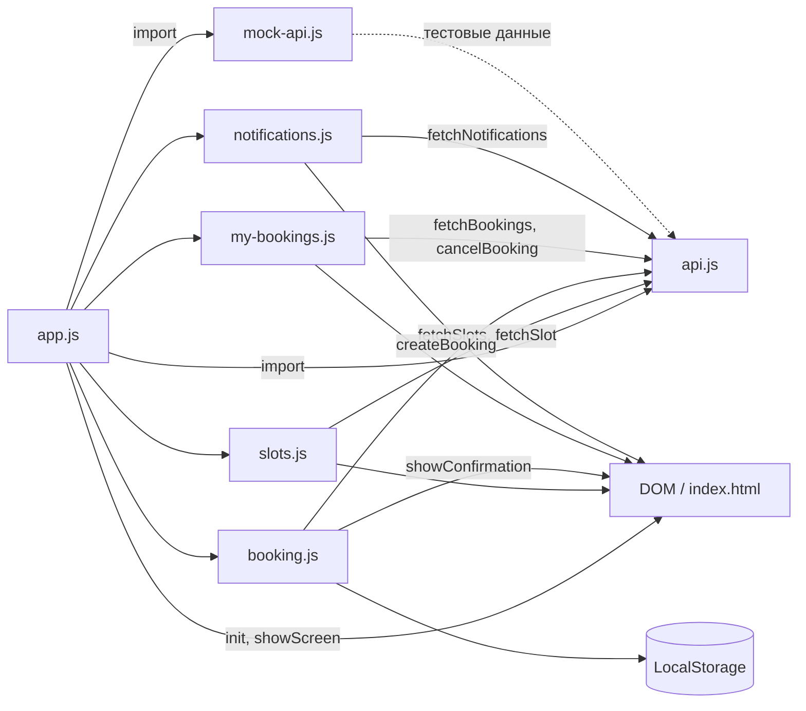
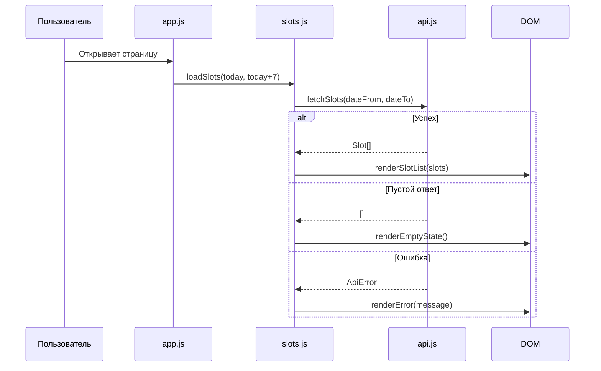
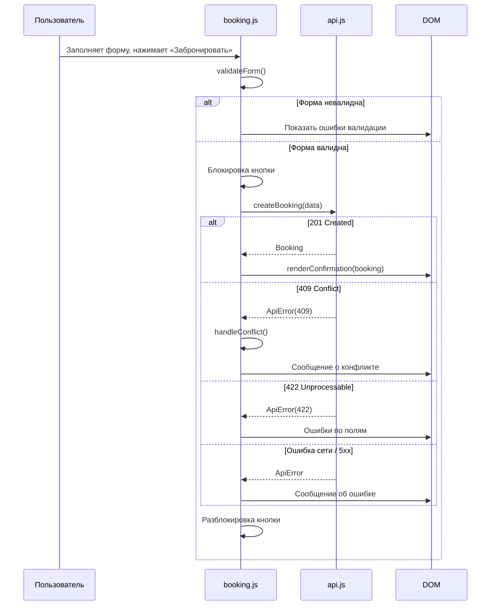
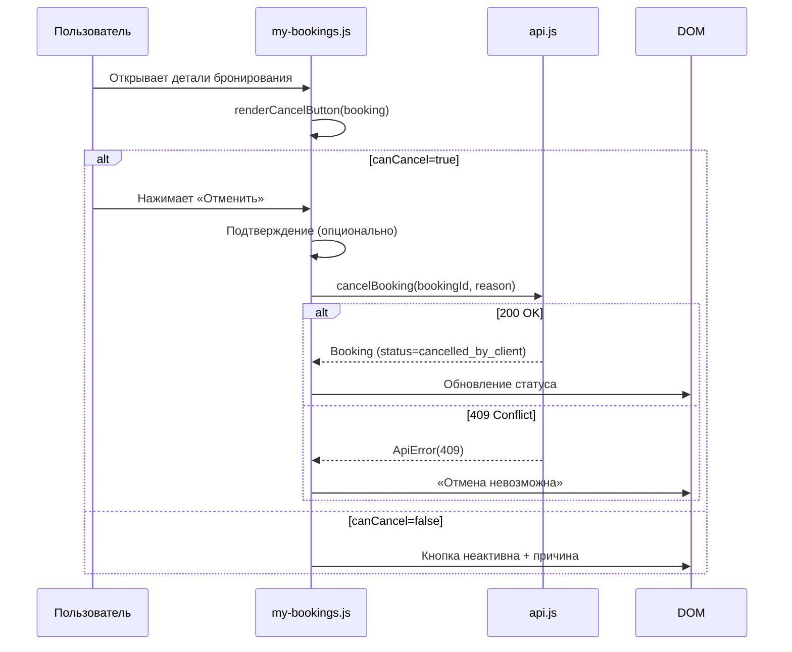
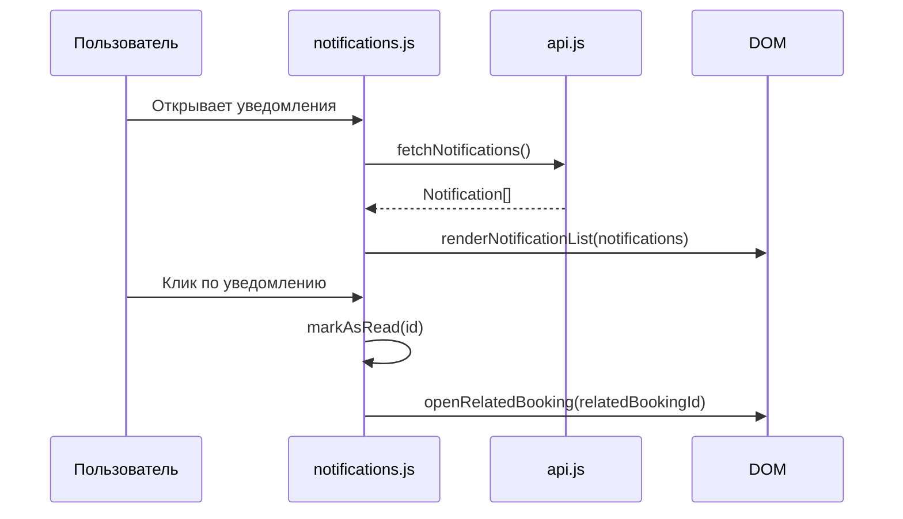

# Karting Drive — архитектурный план

## 1. Назначение документа

Документ описывает архитектуру адаптивного клиентского веб-приложения **Karting Drive** на этапе проектирования (до реализации кода). Он определяет структуру файлов, распределение ответственности между модулями, потоки данных, работу с API и ключевые архитектурные решения.

Документ опирается на требования из [`01-mvp-requirements.md`](01-mvp-requirements.md), схему данных из [`03-data-model.md`](03-data-model.md) и API-контракт из [`04-api-contract.md`](04-api-contract.md).

---

## 2. Архитектурный подход

Приложение строится как **адаптивный веб-клиент (mobile-first)** для существующего backend:

- Единственная HTML-страница (`index.html`) содержит все экраны интерфейса.
- Логика разделена на ES-модули в каталоге `js/`.
- Все данные (слоты, бронирования, уведомления) поступают из API.
- Backend — black-box источник истины; клиент — только потребитель.
- Mock API (`mock-api.js`) для учебной демонстрации без реального backend.
- LocalStorage — только для UX (предзаполнение полей), не источник истины.
- Фреймворки и внешние библиотеки не используются.



---

## 3. Общая схема приложения



**Экраны интерфейса** (секции в `index.html`, переключаемые через CSS-классы):

| Экран | ID (план) | Назначение |
|-------|-----------|------------|
| Расписание слотов | `#screen-slots` | Список слотов на 7 дней с фильтром периода |
| Детали слота | `#screen-slot-detail` | Информация о слоте + выбор участников и экипировки |
| Форма бронирования | `#screen-booking-form` | Ввод имени, телефона, подтверждение |
| Подтверждение | `#screen-confirmation` | ID бронирования, статус, детали |
| Мои бронирования | `#screen-my-bookings` | Список бронирований клиента |
| Детали бронирования | `#screen-booking-detail` | Полная информация + кнопка отмены |
| Уведомления | `#screen-notifications` | Список уведомлений |

---

## 4. Слои приложения

| Слой | Реализация | Ответственность |
|------|------------|-----------------|
| **Presentation** | `index.html`, `style.css`, функции рендеринга | Разметка, стили, отображение данных, переключение экранов |
| **Application** | `app.js`, `slots.js`, `booking.js`, `my-bookings.js`, `notifications.js` | Оркестрация сценариев, валидация, бизнес-логика |
| **API Client** | `api.js`, `mock-api.js` | HTTP-запросы к backend; имитация API; обработка ошибок |
| **Data** | API-ответы (DTO), LocalStorage (только UX) | Временное хранение данных сессии |

---

## 5. Назначение каждого будущего файла

```
karting/
├── index.html              # Структура интерфейса, все экраны SPA
├── css/
│   └── style.css           # Mobile-first адаптивные стили
├── js/
│   ├── app.js              # Инициализация, навигация, корневой рендер
│   ├── api.js              # HTTP-клиент для реального backend
│   ├── mock-api.js         # Имитация backend для учебной версии
│   ├── slots.js            # Просмотр и фильтрация расписания слотов
│   ├── booking.js          # Создание бронирования
│   ├── my-bookings.js      # Просмотр и отмена своих бронирований
│   └── notifications.js    # Уведомления об отмене центром
└── docs/
    ├── 00-client-brief.md
    ├── 00-elicitation.md
    ├── 01-mvp-requirements.md
    ├── 02-architecture.md
    ├── 03-data-model.md
    ├── 04-api-contract.md
    └── prompts.md
```

### `js/api.js`

| Экспорт (план) | Назначение |
|----------------|------------|
| `fetchSlots(dateFrom, dateTo)` | GET /slots |
| `fetchSlot(slotId)` | GET /slots/{slotId} |
| `createBooking(data)` | POST /bookings |
| `fetchBookings(status?)` | GET /bookings |
| `fetchBooking(bookingId)` | GET /bookings/{bookingId} |
| `cancelBooking(bookingId, reason?)` | POST /bookings/{bookingId}/cancel |
| `setBaseUrl(url)` | Переключение между real API и mock |

Каждая функция:
- Принимает параметры, возвращает Promise.
- При ошибке HTTP пробрасывает объект `ApiError` (статус, код, сообщение, детали).
- Не содержит логики отображения — только transport.

### `js/mock-api.js`

| Экспорт (план) | Назначение |
|----------------|------------|
| `MockApi` | Класс/объект, реализующий те же методы, что и `api.js` |
| Данные | Тестовые слоты, бронирования, уведомления |
| Задержка | Имитация сетевой задержки (300–800 мс) |
| 409 симуляция | Возможность сконфигурировать конфликт для тестирования |

Mock API переключается через `setBaseUrl('mock')` или флаг в `app.js`.

### `js/app.js`

| Функция (план) | Назначение |
|----------------|------------|
| `init()` | Точка входа: выбор режима (real/mock), инициализация экранов, навигация |
| `showScreen(screenId)` | Переключение видимого экрана |
| `renderApp()` | Рендер базовой структуры |
| `bindNavigation()` | Обработчики навигационных элементов |
| `handleError(error)` | Централизованная обработка ошибок (показ сообщения) |

### `js/slots.js`

| Функция (план) | Назначение |
|----------------|------------|
| `loadSlots(dateFrom, dateTo)` | Загрузка слотов через API и рендер списка |
| `renderSlotList(slots)` | Отрисовка списка слотов, сгруппированных по дням |
| `renderEmptyState()` | Отображение сообщения при отсутствии слотов |
| `renderSlotCard(slot)` | Карточка слота с основными данными |
| `openSlotDetail(slotId)` | Переход к детальной информации слота |
| `applyFilters()` | Применение фильтра периода |
| `resetFilters()` | Сброс к 7 дням по умолчанию |

### `js/booking.js`

| Функция (план) | Назначение |
|----------------|------------|
| `showBookingForm(slot)` | Открытие формы с деталями слота |
| `renderSlotDetails(slot)` | Отображение трассы, маршала, цены, адреса |
| `renderEquipmentOptions(options)` | Список доступной экипировки |
| `updateTotalPrice()` | Пересчёт стоимости (участники + экипировка) |
| `validateForm()` | Валидация имени, телефона, участников |
| `submitBooking()` | Отправка POST /bookings |
| `handleConflict()` | Обработка 409 |
| `renderConfirmation(booking)` | Экран подтверждения |

### `js/my-bookings.js`

| Функция (план) | Назначение |
|----------------|------------|
| `loadMyBookings(status?)` | Загрузка списка бронирований |
| `renderBookingList(bookings)` | Отрисовка списка |
| `openBookingDetail(bookingId)` | Детальный просмотр бронирования |
| `renderBookingDetail(booking)` | Отображение всех полей, статуса, кнопки отмены |
| `cancelBooking(bookingId)` | Отмена с подтверждением |
| `renderCancelButton(booking)` | Показ/скрытие кнопки в зависимости от canCancel |

### `js/notifications.js`

| Функция (план) | Назначение |
|----------------|------------|
| `loadNotifications()` | Загрузка уведомлений из mock API |
| `renderNotificationList(notifications)` | Отрисовка списка уведомлений |
| `markAsRead(notificationId)` | Отметка прочитанным |
| `getUnreadCount()` | Количество непрочитанных (для badge) |
| `openRelatedBooking(notification)` | Переход к связанному бронированию |

### `css/style.css`

- Mobile-first: минимальные стили для телефона, расширение для планшета/десктопа.
- CSS-переменные для цветовой схемы.
- БЭМ-подход для классов компонентов.
- Адаптивная сетка (flexbox/grid).
- Состояния: загрузка, ошибка, пусто, активно/неактивно.

### `index.html`

- Семантическая разметка: header, main, nav, section.
- Все экраны приложения (см. раздел 3).
- Подключение `<script type="module" src="js/app.js">`.
- Контейнеры для динамического контента.
- Шапка с логотипом, навигацией, badge уведомлений.

---

## 6. Взаимодействие компонентов



**Правила взаимодействия:**

- `api.js` / `mock-api.js` — транспортный слой, не содержит логики отображения.
- `slots.js`, `booking.js`, `my-bookings.js`, `notifications.js` — сценарии использования, содержат и рендеринг, и бизнес-логику.
- `app.js` — оркестратор, инициализирует модули, управляет навигацией.
- `mock-api.js` реализует тот же интерфейс, что и `api.js`, для бесшовного переключения.
- Циклических импортов избегаем.

---

## 7. Поток данных

### 7.1. Загрузка расписания слотов



### 7.2. Создание бронирования



### 7.3. Отмена бронирования



### 7.4. Уведомления от центра



---

## 8. Обработка ошибок API

### 8.1. Принципы

- Все функции `api.js` возвращают `Promise`.
- При HTTP-ошибке пробрасывается `ApiError` с полями `{ status, code, message, details }`.
- Каждый модуль-сценарий обрабатывает `ApiError` и отображает пользователю понятное сообщение.
- Сетевая ошибка (fetch не выполнен) оборачивается в `ApiError(0, 'NETWORK_ERROR', '...')`.

### 8.2. Обработка 409 Conflict

- **POST /bookings → 409**: слот занят. Отобразить сообщение, предложить выбрать другой слот.
- **POST /bookings/{id}/cancel → 409**: отмена невозможна. Показать причину из API.
- После 409 клиент остаётся на текущем экране (данные не сбрасываются).

### 8.3. Обработка других статусов

| Статус | Действие |
|--------|----------|
| 400 | Показать «Некорректный запрос. Проверьте данные» |
| 401 | Показать «Ошибка доступа. Перезагрузите страницу или обратитесь в центр» (детали — после определения механизма идентификации) |
| 404 | Показать «Запрошенные данные не найдены» |
| 422 | Отобразить ошибки валидации по полям формы |
| 500 | Показать «Произошла ошибка на сервере. Попробуйте позже» |
| 503 | Показать «Сервис временно недоступен. Попробуйте позже» |
| Сеть | Показать «Нет соединения. Проверьте интернет» |

---

## 9. Работа с LocalStorage

### 9.1. Принципы

- LocalStorage **не является источником истины** (BR-01).
- Используется только для UX-улучшений: предзаполнение имени и телефона при повторных визитах.
- Не хранит корзину, бронирования или кэш слотов.

### 9.2. Ключи

| Ключ | Тип | Назначение |
|------|-----|------------|
| `kartingCustomerName` | `string` | Последнее введённое имя (предзаполнение) |
| `kartingCustomerPhone` | `string` | Последний введённый телефон (предзаполнение) |

### 9.3. Обработка ошибок

- LocalStorage недоступен — формы работают без предзаполнения.
- Ошибки LocalStorage не влияют на функциональность приложения.

---

## 10. Mock API (учебная версия)

### Назначение

Mock API имитирует работу backend для демонстрации и разработки без реального сервера.

### Принципы

- Реализует все 6 endpoints из API-контракта.
- Содержит тестовые данные: 10+ слотов на 7 дней, 2 трассы, 2 маршала, 5+ бронирований (разные статусы), тестовые уведомления.
- Симулирует задержку 300–800 мс.
- Имеет настройку для симуляции 409 (флаг `simulateConflict: true`).
- Имеет настройку для симуляции ошибок (`simulateError: true`).
- Данные не персистятся между сессиями (сбрасываются при перезагрузке).

### Переключение режима

```javascript
// В app.js
const USE_MOCK = true; // или URL параметр, env, etc.

if (USE_MOCK) {
  setBaseUrl('mock');
}
```

---

## 11. Основные архитектурные решения

| # | Решение | Обоснование |
|---|---------|-------------|
| AD-01 | API-first: все данные из backend через HTTP | Backend — единственный источник истины (R-015) |
| AD-02 | Mock API для учебной версии | Нет реального сервера для разработки (NFR-08) |
| AD-03 | Mobile-first адаптивная вёрстка | Основной канал — телефон клиента (письмо Дениса) |
| AD-04 | SPA без фреймворков на чистом JS | FR-23, NFR-04 |
| AD-05 | ES-модули для разделения кода | NFR-05 |
| AD-06 | ApiError как единый формат ошибок | Единообразная обработка ошибок API (R-031) |
| AD-07 | Блокировка кнопки submit при двойном клике | Предотвращение повторной отправки (NFR-09) |
| AD-08 | LocalStorage только для UX | Не источник истины (R-032) |
| AD-09 | Нет корзины: прямое бронирование | Новый пользовательский путь (без CartItem) |
| AD-10 | Отдельный модуль уведомлений | Уведомления — сквозная функция (R-010, R-008) |

---

## 12. Ограничения архитектуры

| Ограничение | Описание |
|-------------|----------|
| Зависимость от backend | При недоступности API приложение бесполезно (кроме UI) |
| Нет офлайн-режима | Все данные требуют соединения с сервером |
| Механизм идентификации клиента не определён (TBD) | 401 учитывается как возможная ошибка API; конкретный способ идентификации — на подтверждении у заказчика. В MVP нет логина/регистрации |
| Mock API не персистит данные | При перезагрузке тестовые данные сбрасываются |
| Один HTML-файл | Масштабирование UI ограничено размером DOM |
| Нет сборщика (bundler) | Модули загружаются нативно; нужен HTTP-сервер |

---

## 13. Критерии проверки архитектуры

Архитектура считается корректной, если:

- [ ] Структура файлов соответствует схеме проекта.
- [ ] Каждый модуль имеет чёткую зону ответственности.
- [ ] Все user stories US-01 — US-13 покрыты потоками данных.
- [ ] API-клиент обрабатывает все статусы (400, 401, 404, 409, 422, 500, 503).
- [ ] Mock API реализует все endpoints контракта.
- [ ] LocalStorage не используется как источник истины.
- [ ] Отсутствуют ссылки на корзину, тарифы, оплату, админку.
- [ ] Mobile-first подход отражён в именовании экранов и стилях.
- [ ] Документ может служить основой для реализации.
