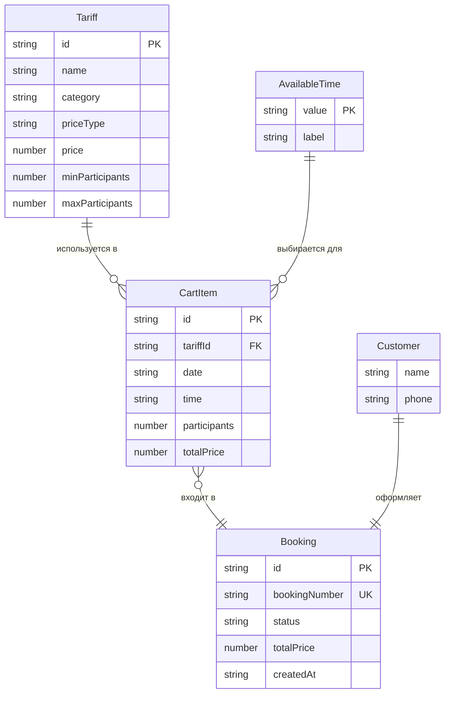

# Karting Drive — схема данных

## 1. Назначение документа

Документ описывает структуру данных клиентского приложения **Karting Drive**: сущности предметной области, их поля, типы, правила валидации, связи, примеры объектов, ключи LocalStorage и правила расчёта стоимости.

Документ опирается на [`01-mvp-requirements.md`](01-mvp-requirements.md) и [`02-architecture.md`](02-architecture.md).

---

## 2. Диаграмма связей сущностей



---

## 3. Сущности

### 3.1. Tariff — тариф

**Назначение:** описывает условия и стоимость заезда в картинг-центре. Является статическим справочником, заданным в `data.js`.

| Поле | Тип | Обязательное | Описание |
|------|-----|:------------:|----------|
| `id` | `string` | да | Уникальный идентификатор тарифа |
| `name` | `string` | да | Название тарифа |
| `category` | `string` | да | Категория: `kids`, `adult`, `team`, `track` |
| `description` | `string` | да | Полное описание тарифа |
| `duration` | `number` | да | Длительность заезда в минутах |
| `price` | `number` | да | Базовая цена (₽): за участника или фиксированная |
| `priceType` | `string` | да | Тип цены: `perPerson` или `fixed` |
| `minAge` | `number \| null` | нет | Минимальный возраст участника (null — не ограничено) |
| `minParticipants` | `number` | да | Минимальное количество участников |
| `maxParticipants` | `number` | да | Максимальное количество участников |
| `restrictions` | `string` | да | Текстовое описание ограничений |
| `image` | `string` | да | Путь или URL изображения тарифа |

**Правила валидации:**

- `id` — непустая строка, уникальна в массиве `TARIFFS`.
- `price` > 0.
- `duration` > 0.
- `minParticipants` ≥ 1.
- `maxParticipants` ≥ `minParticipants`.
- `priceType` ∈ { `perPerson`, `fixed` }.
- `minAge` — null или целое число ≥ 0.

**Пример объекта:**

```javascript
{
  id: "adult",
  name: "Взрослый заезд",
  category: "adult",
  description: "Стандартный заезд для взрослых и подростков от 14 лет. 10 минут на трассе.",
  duration: 10,
  price: 1000,
  priceType: "perPerson",
  minAge: 14,
  minParticipants: 1,
  maxParticipants: 10,
  restrictions: "Возраст от 14 лет. Обязательный инструктаж перед заездом.",
  image: "images/adult.jpg"
}
```

**Связи:**

- Один `Tariff` → многие `CartItem` (через `tariffId`).
- Используется при расчёте `totalPrice` позиции корзины.

---

### 3.2. AvailableTime — время заезда

**Назначение:** описывает доступный временной слот для бронирования. Общий для всех тарифов, задан статически в `data.js`.

| Поле | Тип | Обязательное | Описание |
|------|-----|:------------:|----------|
| `value` | `string` | да | Значение времени в формате `HH:MM` (24-часовой) |
| `label` | `string` | да | Отображаемая метка (обычно совпадает с `value`) |

**Правила валидации:**

- `value` соответствует шаблону `^([01]\d|2[0-3]):[0-5]\d$`.
- `value` уникально в массиве `AVAILABLE_TIMES`.

**Пример объекта:**

```javascript
{
  value: "14:00",
  label: "14:00"
}
```

**Связи:**

- Один `AvailableTime` → многие `CartItem` (через поле `time`).
- Не привязан к конкретному тарифу — все тарифы используют один набор слотов.

---

### 3.3. CartItem — позиция корзины

**Назначение:** представляет один настроенный заезд, добавленный пользователем в корзину. Хранится в памяти приложения и персистится в LocalStorage (`kartingCart`).

| Поле | Тип | Обязательное | Описание |
|------|-----|:------------:|----------|
| `id` | `string` | да | Уникальный идентификатор позиции |
| `tariffId` | `string` | да | Ссылка на `Tariff.id` |
| `tariffName` | `string` | да | Название тарифа (денормализация для отображения) |
| `date` | `string` | да | Дата заезда в формате `YYYY-MM-DD` |
| `time` | `string` | да | Время заезда в формате `HH:MM` |
| `participants` | `number` | да | Количество участников |
| `priceType` | `string` | да | Тип цены: `perPerson` или `fixed` (копия из тарифа) |
| `price` | `number` | да | Базовая цена тарифа (копия из тарифа) |
| `totalPrice` | `number` | да | Итоговая стоимость позиции (₽) |

**Правила валидации:**

- `id` — непустая строка, уникальна в корзине.
- `tariffId` — должен существовать в `TARIFFS`.
- `date` — не раньше текущей даты (BR-06).
- `time` — обязательно, должно быть в `AVAILABLE_TIMES`.
- `participants` — целое число в диапазоне `[minParticipants, maxParticipants]` соответствующего тарифа.
- `totalPrice` = результат `calculatePrice(tariff, participants)`.
- `priceType` ∈ { `perPerson`, `fixed` }.

**Пример объекта:**

```javascript
{
  id: "ci-1709123456789",
  tariffId: "adult",
  tariffName: "Взрослый заезд",
  date: "2026-07-05",
  time: "14:00",
  participants: 2,
  priceType: "perPerson",
  price: 1000,
  totalPrice: 2000
}
```

**Связи:**

- Многие `CartItem` → один `Tariff` (через `tariffId`).
- Многие `CartItem` → один `Booking` (копируются в `Booking.items` при оформлении).

---

### 3.4. Customer — клиент

**Назначение:** контактные данные пользователя, вводимые при оформлении бронирования. Не хранится отдельно — включается в объект `Booking`.

| Поле | Тип | Обязательное | Описание |
|------|-----|:------------:|----------|
| `name` | `string` | да | Имя клиента |
| `phone` | `string` | да | Номер телефона |

**Правила валидации:**

- `name` — непустая строка, минимум 2 символа после trim (FR-14).
- `phone` — строка, содержащая минимум 10 цифр; допустимы пробелы, скобки, дефисы, знак `+`.

**Пример объекта:**

```javascript
{
  name: "Иван Петров",
  phone: "+7 999 123-45-67"
}
```

**Связи:**

- Один `Customer` → один `Booking` (поля `customerName`, `customerPhone`).

---

### 3.5. Booking — бронирование

**Назначение:** подтверждённый заказ после оформления. Создаётся на клиенте, сохраняется в LocalStorage (`kartingBookings`) и отображается на экране подтверждения.

| Поле | Тип | Обязательное | Описание |
|------|-----|:------------:|----------|
| `id` | `string` | да | Внутренний идентификатор бронирования |
| `bookingNumber` | `string` | да | Публичный номер бронирования (`KD-YYYYMMDD-XXXX`) |
| `customerName` | `string` | да | Имя клиента |
| `customerPhone` | `string` | да | Телефон клиента |
| `items` | `CartItem[]` | да | Копия позиций корзины на момент оформления |
| `totalPrice` | `number` | да | Общая сумма заказа (₽) |
| `createdAt` | `string` | да | Дата и время создания (ISO 8601) |
| `status` | `string` | да | Статус бронирования; начальное значение: `new` |

**Правила валидации:**

- `bookingNumber` — формат `KD-YYYYMMDD-XXXX`, где `XXXX` — 4 символа `[A-Z0-9]` (FR-16).
- `items` — непустой массив (оформление пустой корзины запрещено).
- `totalPrice` = сумма `items[].totalPrice`.
- `status` при создании = `"new"`.
- `createdAt` — валидная ISO-строка.

**Пример объекта:**

```javascript
{
  id: "bk-1709123456790",
  bookingNumber: "KD-20260705-A3F2",
  customerName: "Иван Петров",
  customerPhone: "+7 999 123-45-67",
  items: [
    {
      id: "ci-1709123456789",
      tariffId: "adult",
      tariffName: "Взрослый заезд",
      date: "2026-07-05",
      time: "14:00",
      participants: 2,
      priceType: "perPerson",
      price: 1000,
      totalPrice: 2000
    }
  ],
  totalPrice: 2000,
  createdAt: "2026-07-05T14:30:00.000Z",
  status: "new"
}
```

**Связи:**

- Один `Booking` → один `Customer` (встроенные поля).
- Один `Booking` → многие `CartItem` (массив `items`).

---

## 4. Демонстрационные данные тарифов

### AVAILABLE_TIMES

```javascript
const AVAILABLE_TIMES = [
  { value: "10:00", label: "10:00" },
  { value: "12:00", label: "12:00" },
  { value: "14:00", label: "14:00" },
  { value: "16:00", label: "16:00" },
  { value: "18:00", label: "18:00" },
  { value: "20:00", label: "20:00" }
];
```

### TARIFFS

```javascript
const TARIFFS = [
  {
    id: "kids",
    name: "Детский заезд",
    category: "kids",
    description: "Заезд для детей от 7 лет. 10 минут на адаптированной трассе с обязательным инструктажем.",
    duration: 10,
    price: 700,
    priceType: "perPerson",
    minAge: 7,
    minParticipants: 1,
    maxParticipants: 8,
    restrictions: "Возраст от 7 лет. Рост не менее 120 см. Сопровождение взрослого для детей до 12 лет.",
    image: "images/kids.jpg"
  },
  {
    id: "adult",
    name: "Взрослый заезд",
    category: "adult",
    description: "Стандартный заезд для взрослых и подростков от 14 лет. 10 минут на основной трассе.",
    duration: 10,
    price: 1000,
    priceType: "perPerson",
    minAge: 14,
    minParticipants: 1,
    maxParticipants: 10,
    restrictions: "Возраст от 14 лет. Обязательный инструктаж перед заездом.",
    image: "images/adult.jpg"
  },
  {
    id: "team",
    name: "Командный заезд",
    category: "team",
    description: "Групповой заезд для команд от 4 человек. 20 минут на трассе с возможностью смены kart.",
    duration: 20,
    price: 1800,
    priceType: "perPerson",
    minAge: null,
    minParticipants: 4,
    maxParticipants: 10,
    restrictions: "Минимум 4 участника. Рекомендуется предварительная запись.",
    image: "images/team.jpg"
  },
  {
    id: "track-rental",
    name: "Аренда трассы",
    category: "track",
    description: "Полная аренда трассы на 60 минут. Подходит для корпоративных мероприятий и частных заездов.",
    duration: 60,
    price: 20000,
    priceType: "fixed",
    minAge: null,
    minParticipants: 1,
    maxParticipants: 12,
    restrictions: "До 12 участников на трассе одновременно. Бронирование минимум за 24 часа.",
    image: "images/track.jpg"
  }
];
```

---

## 5. LocalStorage

### Структура ключей

| Ключ | Тип | Описание |
|------|-----|----------|
| `kartingCart` | `CartItem[]` | Текущая корзина пользователя |
| `kartingBookings` | `Booking[]` | Журнал оформленных бронирований |

### kartingCart

```javascript
// Чтение
const cart = JSON.parse(localStorage.getItem("kartingCart") || "[]");

// Запись
localStorage.setItem("kartingCart", JSON.stringify(cartItems));

// Очистка
localStorage.setItem("kartingCart", "[]");
```

**Поведение:**

- Запись выполняется при каждом изменении корзины (add, update, remove).
- При загрузке приложения корзина восстанавливается из этого ключа.
- После оформления бронирования ключ перезаписывается пустым массивом.

### kartingBookings

```javascript
// Чтение
const bookings = JSON.parse(localStorage.getItem("kartingBookings") || "[]");

// Добавление нового бронирования
bookings.push(newBooking);
localStorage.setItem("kartingBookings", JSON.stringify(bookings));
```

**Поведение:**

- При успешном оформлении новый `Booking` добавляется в массив.
- Используется для учебной демонстрации локального хранения без сервера.
- Не заменяет серверную базу данных.

---

## 6. Правила расчёта стоимости

### Функция calculatePrice

```javascript
/**
 * @param {Tariff} tariff
 * @param {number} participants
 * @returns {number} totalPrice в рублях
 */
function calculatePrice(tariff, participants) {
  if (tariff.priceType === "perPerson") {
    return tariff.price * participants;
  }
  if (tariff.priceType === "fixed") {
    return tariff.price;
  }
  return 0;
}
```

### Таблица расчёта

| priceType | Формула | Пример |
|-----------|---------|--------|
| `perPerson` | `price × participants` | Взрослый заезд, 2 участника: 1000 × 2 = **2000 ₽** |
| `fixed` | `price` (не зависит от participants) | Аренда трассы, 8 участников: **20000 ₽** |

### Общая сумма корзины

```javascript
const cartTotal = cartItems.reduce((sum, item) => sum + item.totalPrice, 0);
```

### Общая сумма бронирования

```javascript
const bookingTotal = booking.items.reduce((sum, item) => sum + item.totalPrice, 0);
// Должна совпадать с booking.totalPrice
```

---

## 7. Правила проверки (валидация)

### 7.1. Параметры заезда (перед добавлением в корзину)

| Правило | ID | Условие | Сообщение об ошибке |
|---------|----|---------|---------------------|
| Дата не в прошлом | VR-01 | `date >= today` | «Нельзя выбрать прошедшую дату» |
| Время выбрано | VR-02 | `time !== ""` и `time ∈ AVAILABLE_TIMES` | «Выберите время заезда» |
| Участники — целое число | VR-03 | `Number.isInteger(participants)` | «Укажите целое число участников» |
| Минимум участников | VR-04 | `participants >= tariff.minParticipants` | «Минимум N участников для тарифа „X"» |
| Максимум участников | VR-05 | `participants <= tariff.maxParticipants` | «Максимум N участников для тарифа „X"» |
| Тариф существует | VR-06 | `getTariffById(tariffId) !== undefined` | «Тариф не найден» |

### 7.2. Редактирование позиции в корзине

| Правило | ID | Условие | Сообщение об ошибке |
|---------|----|---------|---------------------|
| Участники в пределах тарифа | VR-07 | VR-03, VR-04, VR-05 для связанного тарифа | Аналогично VR-03–VR-05 |
| Пересчёт стоимости | VR-08 | `totalPrice = calculatePrice(tariff, participants)` | — |

### 7.3. Оформление бронирования

| Правило | ID | Условие | Сообщение об ошибке |
|---------|----|---------|---------------------|
| Корзина не пуста | VR-09 | `cartItems.length > 0` | «Корзина пуста» |
| Имя обязательно | VR-10 | `name.trim().length >= 2` | «Введите имя» |
| Телефон обязателен | VR-11 | `phoneDigits.length >= 10` | «Введите корректный номер телефона» |

### 7.4. Вспомогательная функция проверки телефона

```javascript
function getPhoneDigits(phone) {
  return phone.replace(/\D/g, "");
}

function isValidPhone(phone) {
  return getPhoneDigits(phone).length >= 10;
}
```

---

## 8. Генерация идентификаторов

| Сущность | Формат | Пример |
|----------|--------|--------|
| CartItem.id | `ci-{timestamp}` | `ci-1709123456789` |
| Booking.id | `bk-{timestamp}` | `bk-1709123456790` |
| Booking.bookingNumber | `KD-{YYYYMMDD}-{XXXX}` | `KD-20260705-A3F2` |

```javascript
function generateBookingNumber() {
  const now = new Date();
  const date = now.toISOString().slice(0, 10).replace(/-/g, "");
  const chars = "ABCDEFGHIJKLMNOPQRSTUVWXYZ0123456789";
  let suffix = "";
  for (let i = 0; i < 4; i++) {
    suffix += chars[Math.floor(Math.random() * chars.length)];
  }
  return `KD-${date}-${suffix}`;
}
```

---

## 9. Соответствие требованиям MVP

| Требование MVP | Реализация в модели данных |
|----------------|---------------------------|
| FR-01, FR-02 | `TARIFFS` в `data.js` с полным набором полей |
| FR-04, FR-05, BR-06 | VR-01: дата не в прошлом |
| FR-06 | `AVAILABLE_TIMES`, поле `CartItem.time` |
| FR-07 | VR-03–VR-05 |
| FR-08 | `calculatePrice()` с учётом `priceType` |
| FR-09 | `CartItem.id` |
| FR-11 | Ключ `kartingCart` |
| FR-14 | VR-10, VR-11 |
| FR-16 | `generateBookingNumber()` |
| BR-01 | Правила расчёта без скидок |
| BR-02 | `Booking.items[]` — несколько позиций |
| BR-03 | Один `bookingNumber` на `Booking` |

---

## 10. Примечание о расхождении ключей LocalStorage

В [`01-mvp-requirements.md`](01-mvp-requirements.md) (FR-11) указан ключ `karting-drive-cart`. В настоящем документе и архитектурном плане приняты ключи **`kartingCart`** и **`kartingBookings`**. При реализации используются ключи из данного документа.
