# Karting Drive — схема данных (API-сущности)

## 1. Назначение документа

Документ описывает структуру данных, которыми оперирует клиентское веб-приложение **Karting Drive**. Все сущности являются DTO (Data Transfer Objects), получаемыми от backend через API. Каноническая схема данных — контракт API (docs/04-api-contract.md).

Документ опирается на [`01-mvp-requirements.md`](01-mvp-requirements.md), [`02-architecture.md`](02-architecture.md) и [`04-api-contract.md`](04-api-contract.md).

---

## 2. Диаграмма связей сущностей

```mermaid
erDiagram
    Slot ||--|| TrackConfiguration : "имеет"
    Slot ||--|| MarshalSummary : "назначен"
    Slot ||--|{ Booking : "бронируется"
    Booking ||--|{ EquipmentBooking : "включает"
    Booking ||--o| CancellationInfo : "содержит"
    Slot ||--|| LocationInfo : "проводится"

    Slot {
        string id PK
        datetime startTime
        datetime endTime
        int availableKarts
        int maxParticipants
        float pricePerPerson
        enum status
    }

    TrackConfiguration {
        string id PK
        string name
        string description
    }

    MarshalSummary {
        string id PK
        string name
    }

    LocationInfo {
        string address
        string meetingPoint
    }

    Booking {
        string id PK
        string slotId FK
        string customerName
        string customerPhone
        int participants
        float totalPrice
        enum status
        datetime cancellationDeadline
        boolean canCancel
        datetime createdAt
    }

    EquipmentBooking {
        string id PK
        string name
        float pricePerUnit
        int quantity
    }

    CancellationInfo {
        enum cancelledBy
        string reason
        datetime cancelledAt
    }

    Notification {
        string id PK
        enum type
        string message
        string relatedBookingId FK
        boolean read
        datetime createdAt
    }
```



---

## 3. Статусы бронирования

| Статус | Описание | Отображение |
|--------|----------|-------------|
| `confirmed` | Бронь подтверждена | «Подтверждено» |
| `cancelled_by_client` | Отменено клиентом | «Отменено» |
| `cancelled_by_center` | Отменено центром (погода, тех. причины) | «Отменён центром» |
| `completed` | Заезд проведён | «Завершено» |

Статусы приходят от API и не вычисляются на клиенте.

---

## 4. Сущности

### 4.1. Slot — слот расписания

**Назначение:** описывает доступный временной слот для бронирования заезда. Поступает из backend через GET /slots.

| Поле | Тип | Обязательное | Описание |
|------|-----|:------------:|----------|
| `id` | `string` | да | Уникальный идентификатор слота |
| `startTime` | `string` (ISO 8601) | да | Дата и время старта заезда |
| `endTime` | `string` (ISO 8601) | да | Дата и время окончания |
| `availableKarts` | `number` | да | Количество свободных картов (на момент запроса) |
| `maxParticipants` | `number` | да | Максимум участников (обычно ≤ availableKarts) |
| `pricePerPerson` | `number` | да | Цена за одного участника (₽) |
| `status` | `string` | да | `available` / `full` / `cancelled` |
| `track` | `TrackConfiguration` | да | Конфигурация трассы |
| `marshal` | `MarshalSummary` | да | Маршал, назначенный на слот |
| `location` | `LocationInfo` | да | Адрес и место сбора |

**Пример объекта:**

```json
{
  "id": "slot-001",
  "startTime": "2026-07-05T10:00:00Z",
  "endTime": "2026-07-05T10:20:00Z",
  "availableKarts": 8,
  "maxParticipants": 8,
  "pricePerPerson": 1000,
  "status": "available",
  "track": {
    "id": "track-short",
    "name": "Короткая трасса",
    "description": "Трасса для новичков, 600 м"
  },
  "marshal": {
    "id": "mar-001",
    "name": "Алексей С."
  },
  "location": {
    "address": "ул. Картинговая, 1, окраина города",
    "meetingPoint": "Зона регистрации у входа"
  }
}
```

---

### 4.2. TrackConfiguration — конфигурация трассы

**Назначение:** описывает конфигурацию трассы, на которой проводится заезд. Приходит в составе объекта Slot.

| Поле | Тип | Обязательное | Описание |
|------|-----|:------------:|----------|
| `id` | `string` | да | Идентификатор конфигурации трассы |
| `name` | `string` | да | Название (например, «Короткая трасса», «Длинная трасса») |
| `description` | `string` | да | Описание трассы |

**Пример объекта:**

```json
{
  "id": "track-short",
  "name": "Короткая трасса",
  "description": "Трасса для новичков, 600 м"
}
```

---

### 4.3. MarshalSummary — маршал

**Назначение:** краткая информация о маршале-инструкторе, назначенном на слот. Приходит в составе объекта Slot.

| Поле | Тип | Обязательное | Описание |
|------|-----|:------------:|----------|
| `id` | `string` | да | Идентификатор маршала |
| `name` | `string` | да | Имя маршала |

**Пример объекта:**

```json
{
  "id": "mar-001",
  "name": "Алексей С."
}
```

---

### 4.4. LocationInfo — информация о местоположении

**Назначение:** адрес центра и место сбора для заезда. Приходит в составе объекта Slot.

| Поле | Тип | Обязательное | Описание |
|------|-----|:------------:|----------|
| `address` | `string` | да | Адрес картинг-центра |
| `meetingPoint` | `string` | да | Место сбора на территории |

**Пример объекта:**

```json
{
  "address": "ул. Картинговая, 1, окраина города",
  "meetingPoint": "Зона регистрации у входа"
}
```

---

### 4.5. EquipmentOption — доступная экипировка

**Назначение:** описывает позицию экипировки, которую клиент может заказать дополнительно. Список может быть получен через отдельный endpoint или в составе информации о слоте (уточняется).

| Поле | Тип | Обязательное | Описание |
|------|-----|:------------:|----------|
| `id` | `string` | да | Идентификатор (например, `helmet`, `balaclava`) |
| `name` | `string` | да | Название |
| `pricePerUnit` | `number` | да | Цена за единицу (₽) |

**Пример объекта:**

```json
{
  "id": "helmet",
  "name": "Шлем",
  "pricePerUnit": 200
}
```

### 4.6. EquipmentBooking — экипировка в бронировании

**Назначение:** позиция экипировки, включённая в бронирование. Приходит в составе объекта Booking.

| Поле | Тип | Обязательное | Описание |
|------|-----|:------------:|----------|
| `id` | `string` | да | Идентификатор позиции |
| `name` | `string` | да | Название |
| `pricePerUnit` | `number` | да | Цена за единицу |
| `quantity` | `number` | да | Количество |

---

### 4.7. Booking — бронирование

**Назначение:** подтверждённая запись клиента на слот. Создаётся через POST /bookings, читается через GET /bookings.

| Поле | Тип | Обязательное | Описание |
|------|-----|:------------:|----------|
| `id` | `string` | да | Идентификатор бронирования (присваивается backend) |
| `slotId` | `string` | да | Ссылка на слот |
| `customerName` | `string` | да | Имя клиента |
| `customerPhone` | `string` | да | Телефон клиента |
| `participants` | `number` | да | Количество участников |
| `equipment` | `EquipmentBooking[]` | нет | Заказанная экипировка (пустой массив — своя экипировка) |
| `totalPrice` | `number` | да | Итоговая стоимость (₽) |
| `status` | `string` | да | `confirmed` / `cancelled_by_client` / `cancelled_by_center` / `completed` |
| `cancellationDeadline` | `string` (ISO 8601) | да | Крайний срок отмены |
| `canCancel` | `boolean` | да | Разрешена ли отмена в текущий момент |
| `cancellationInfo` | `CancellationInfo` | нет | Информация об отмене (null если не отменено) |
| `createdAt` | `string` (ISO 8601) | да | Дата и время создания |
| `startTime` | `string` (ISO 8601) | да | Дата и время старта (для списка) |
| `trackName` | `string` | да | Название трассы (для списка, денормализация) |
| `marshalName` | `string` | да | Имя маршала (для списка, денормализация) |

**Правила:**

- `totalPrice` = `participants × pricePerPerson` + сумма `equipment[].pricePerUnit × equipment[].quantity`.
- `status` определяется backend; клиент только отображает.
- `canCancel` может измениться со временем (после дедлайна → false).

**Пример объекта:**

```json
{
  "id": "bk-42",
  "slotId": "slot-001",
  "customerName": "Иван Петров",
  "customerPhone": "+7 999 123-45-67",
  "participants": 2,
  "equipment": [
    { "id": "helmet", "name": "Шлем", "pricePerUnit": 200, "quantity": 2 }
  ],
  "totalPrice": 2400,
  "status": "confirmed",
  "cancellationDeadline": "2026-07-05T09:50:00Z",
  "canCancel": true,
  "cancellationInfo": null,
  "createdAt": "2026-07-04T12:00:00Z",
  "startTime": "2026-07-05T10:00:00Z",
  "trackName": "Короткая трасса",
  "marshalName": "Алексей С."
}
```

---

### 4.8. CancellationInfo — информация об отмене

**Назначение:** детали отмены бронирования. Присутствует в Booking только при status = cancelled_by_client или cancelled_by_center.

| Поле | Тип | Обязательное | Описание |
|------|-----|:------------:|----------|
| `cancelledBy` | `string` | да | `client` или `center` |
| `reason` | `string` | нет | Причина отмены (null если не указана) |
| `cancelledAt` | `string` (ISO 8601) | да | Дата и время отмены |

**Пример объекта:**

```json
{
  "cancelledBy": "center",
  "reason": "Сильный дождь. Заезд отменён по погодным условиям.",
  "cancelledAt": "2026-07-05T08:00:00Z"
}
```

---

### 4.9. CustomerSummary — клиент (сводка)

**Назначение:** контактные данные клиента, передаваемые при создании бронирования. Отдельно не хранится — включается в Booking.

| Поле | Тип | Обязательное | Описание |
|------|-----|:------------:|----------|
| `name` | `string` | да | Имя клиента |
| `phone` | `string` | да | Номер телефона |

**Правила валидации:**

- `name` — непустая строка, минимум 2 символа после trim.
- `phone` — строка, содержащая минимум 10 цифр; допустимы пробелы, скобки, дефисы, `+`.

---

### 4.10. Notification — уведомление

**Назначение:** уведомление клиенту от системы. В учебной версии — из mock API (имитация push-уведомлений от backend).

| Поле | Тип | Обязательное | Описание |
|------|-----|:------------:|----------|
| `id` | `string` | да | Идентификатор уведомления |
| `type` | `string` | да | `booking_cancelled_by_center` / `booking_reminder` |
| `message` | `string` | да | Текст уведомления |
| `relatedBookingId` | `string` | да | Связанное бронирование |
| `read` | `boolean` | да | Прочитано ли уведомление |
| `createdAt` | `string` (ISO 8601) | да | Дата создания |

**Пример объекта:**

```json
{
  "id": "notif-001",
  "type": "booking_cancelled_by_center",
  "message": "Ваш заезд 5 июля в 10:00 отменён центром. Причина: сильный дождь.",
  "relatedBookingId": "bk-42",
  "read": false,
  "createdAt": "2026-07-05T08:00:00Z"
}
```

---

### 4.11. APIError — ошибка API

**Назначение:** стандартный формат ошибки, возвращаемый backend при HTTP-статусах 4xx и 5xx.

| Поле | Тип | Обязательное | Описание |
|------|-----|:------------:|----------|
| `status` | `number` | да | HTTP-статус |
| `code` | `string` | да | Код ошибки (например, `SLOT_FULL`, `CANCELLATION_NOT_ALLOWED`) |
| `message` | `string` | да | Сообщение для пользователя |
| `details` | `FieldError[]` | нет | Детали ошибок по полям (для 422) |

**FieldError:**

| Поле | Тип | Обязательное | Описание |
|------|-----|:------------:|----------|
| `field` | `string` | да | Имя поля |
| `message` | `string` | да | Описание ошибки |

**Пример объекта:**

```json
{
  "status": 409,
  "code": "SLOT_FULL",
  "message": "Выбранный слот больше не имеет свободных картов. Пожалуйста, выберите другой слот.",
  "details": null
}
```

---

## 5. LocalStorage

LocalStorage **не является источником истины** (R-032). Используется только для UX:

| Ключ | Тип | Назначение |
|------|-----|------------|
| `kartingCustomerName` | `string` | Последнее введённое имя (предзаполнение формы) |
| `kartingCustomerPhone` | `string` | Последний введённый телефон (предзаполнение формы) |

Бронирования, слоты и любые другие данные **не кэшируются** в LocalStorage.

---

## 6. Правила расчёта стоимости

Стоимость рассчитывается на клиенте для предварительного отображения, но финальная стоимость устанавливается backend при создании бронирования.

```
totalPrice = participants × slot.pricePerPerson + Σ(equipment[i].pricePerUnit × equipment[i].quantity)
```

**Пример:**

```
Участники: 2
Цена слота: 1000 ₽/чел
Экипировка: 2 × шлем (200 ₽) = 400 ₽
Итого: 2 × 1000 + 400 = 2400 ₽
```

---

## 7. Соответствие требованиям

| Требование | Реализация |
|------------|------------|
| US-01 — слоты на 7 дней | `Slot[]` из GET /slots с dateFrom/dateTo |
| US-04 — детали слота | `Slot` с `TrackConfiguration`, `MarshalSummary`, `LocationInfo` |
| US-05 — количество участников | `participants` ≤ `Slot.availableKarts` |
| US-06 — экипировка | `EquipmentOption[]` → `EquipmentBooking[]` |
| US-07 — создание брони | POST /bookings → `Booking` |
| US-10 — отмена | POST /bookings/{id}/cancel → `Booking.status = cancelled_by_client` |
| US-12 — уведомления | `Notification` из mock API |
| R-008 — отмена центром | `Booking.status = cancelled_by_center` + `CancellationInfo` |
| R-027 — canCancel | `Booking.canCancel`, `Booking.cancellationDeadline` |
| R-031 — 409 Conflict | `APIError` со статусом 409 |
